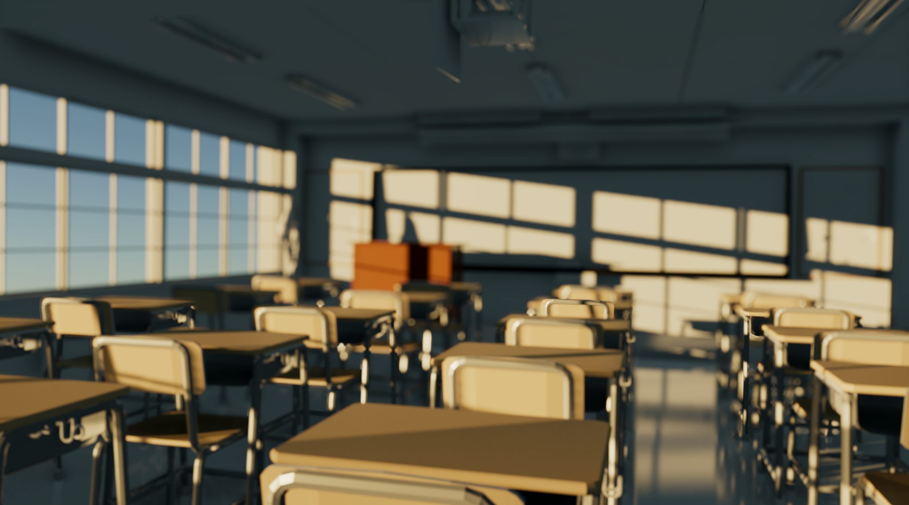
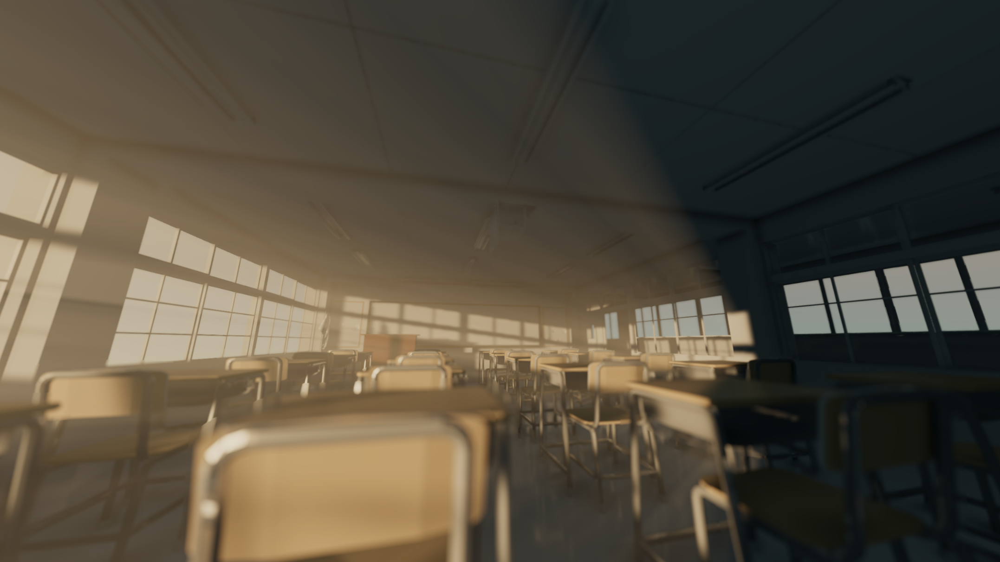
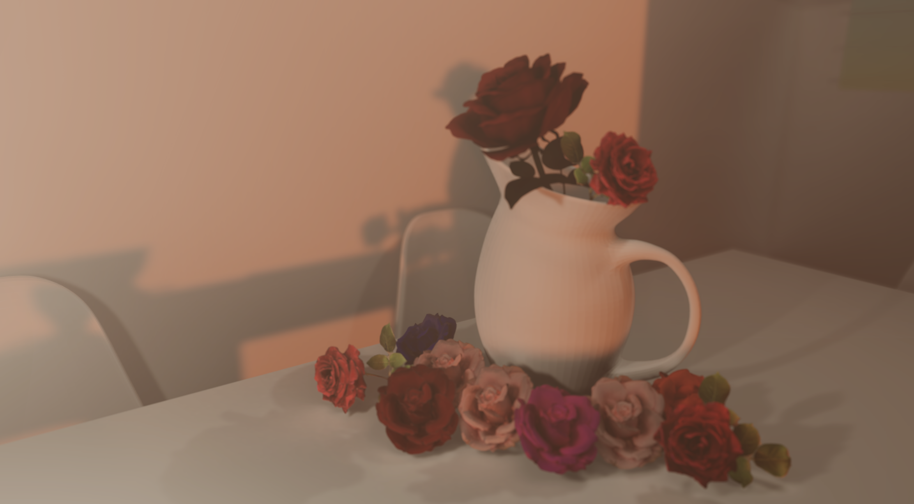

Knowing issues ：  
1.You should click the Override Post FX toggle in the Melody Render Pipeline component of the camera when first going into the scene.
2.Forward or Deferred Lit should be rendered with Option "Copy Depth" or "Use GBuffer" on and never run parallel.  
  
Feature include ：  
1.Base forward rendering path pipeline  
2.Cascade shadow map  
3.Directional light/Per object point light  
4.Geometry buffer  
5.Velocity buffer  
6.Simple PBR  
7.Complex toon shading  
8.Post-processing stack: Bloom,color grading,outline,lightshift  
9.Volumetric cloud  
10.Atmosphere scattering  
11.Screen-space ambient occlusion:SSAO,HBAO,GTAO  
12.Screen-space Reflection:SSR,SSSR  
13.Screen-space Global Illumination  
14.Temporal Antialiasing  
15.Physical Camera: Depth of Field,Auto Exposure,Lens Falre  
16.FFT Ocean  

VERY IMPROTANT:  
Please let me know if you find bug in this project.  

Screenshots:  
  
  
  
  
